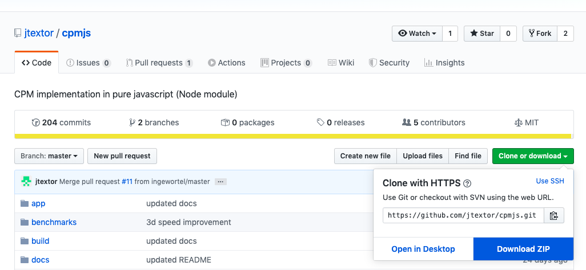

# Getting Started

## Set up Artistoo in 3 easy steps

### Step 1: download the repository.

**Via the Github website**

Visit the [Github repository](https://github.com/ingewortel/artistoo) and click on the
green "clone or download" button, then select "Download ZIP":




Save the zipped folder somewhere on your computer and unzip.

**Via the command line**

Alternatively, in the console, go to the folder where you want to save Artistoo,
and clone the repository:

```$xslt
cd folder/to/save-into/
git clone https://github.com/ingewortel/artistoo.git
```

### Step 2: install node dependencies.

Most users will run Artistoo in browser simulations only and will not need to
extend the software with custom modules. If that's you, you can skip this step.
But if you plan to use Artistoo from the command line using node, or if you plan
to write your own modules (such as hamiltonian terms), you will need to install
some node dependencies.

To do this, go to the `artistoo/` folder from the command line and install the
required packages automatically using `npm`:

```$xslt
cd folder/containing/artistoo
npm install
```

If you do not have `nodejs` and its package manager `npm`, see
[this page](https://nodejs.org/en/download/) to install them first.

### Step 3: link the build in your code.

You can now use Artistoo! See this [tutorial](quickstart.html) to build your first
simulation, or start from one of the simulations in the `artistoo/examples/`
folder. In these examples, you will see that the package can be loaded as
follows:

```$xslt
<script src="path/to/artistoo/build/artistoo.js"></script>
```

for html, and

```$xslt
let CPM = require("path/to/artistoo/build/artistoo-cjs.js")
```

for node scripts.

When you include these lines in your own scripts, just make sure they contain
the correct path from your simulation file to the `artistoo/build/` folder.

### Additional notes

If you wish to build simulations in a different directory than the `artistoo`
folder, it may be convenient to create a symbolic link to the `build` folder
there:

```
cd path/to/my/simulations
ln -s path/to/artistoo/build build
```

You can then access the code using:
```$xslt
<script src="path/to/my/simulations/build/artistoo.js"></script>
```
or
```$xslt
let CPM = require("path/to/my/simulations/build/artistoo-cjs.js")
```

Finally, if you want to run Artistoo simulations with nodejs from this folder,
you will need to create a link to the installed `node_modules` from step 2:

```console
cd path/to/my/simulations
ln -s path/to/artistoo/node_modules node_modules
```
